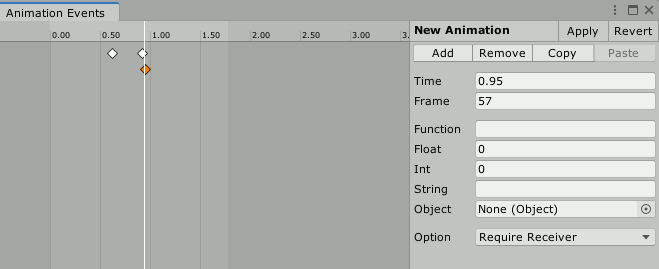
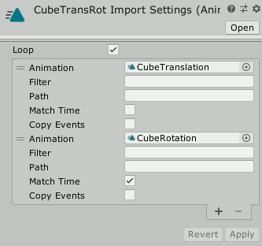
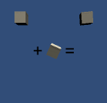

# AnimationTools

Handy toolset for animation clips.

## Features

- Import constant curve animation without hassle.
- Dopesheet for animation events.
- Mix multiple AnimationClips into single AnimationClip.

## Requirements

- Unity 2019+

## Screenshots

### Animation Event Editor

### Animation Clip Mixer

